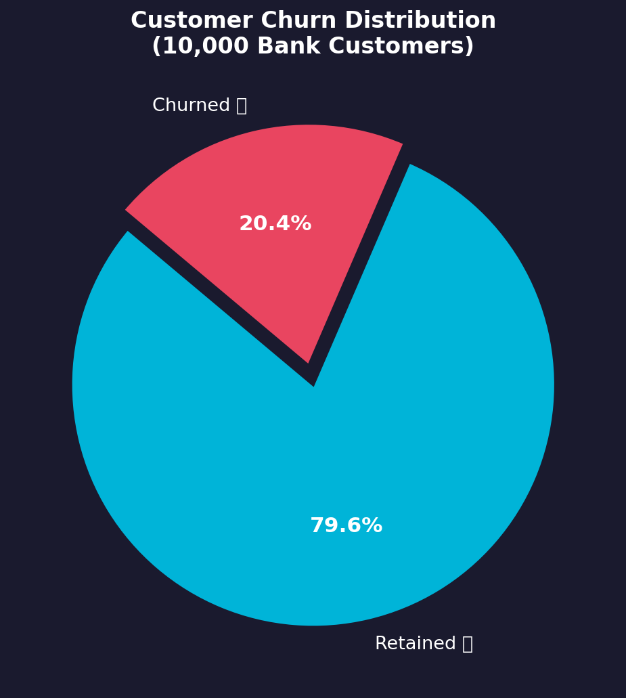
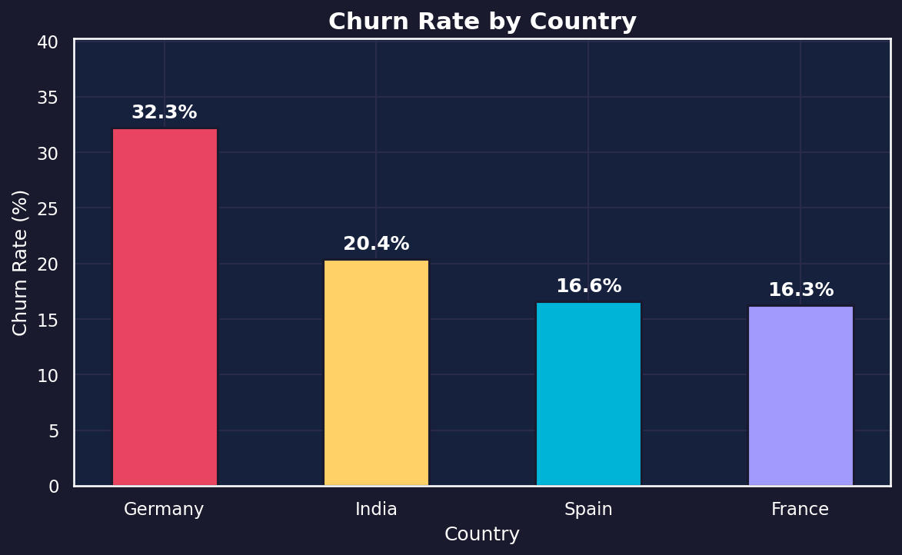
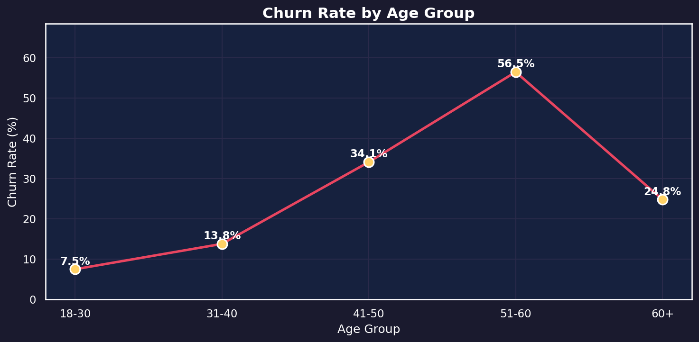
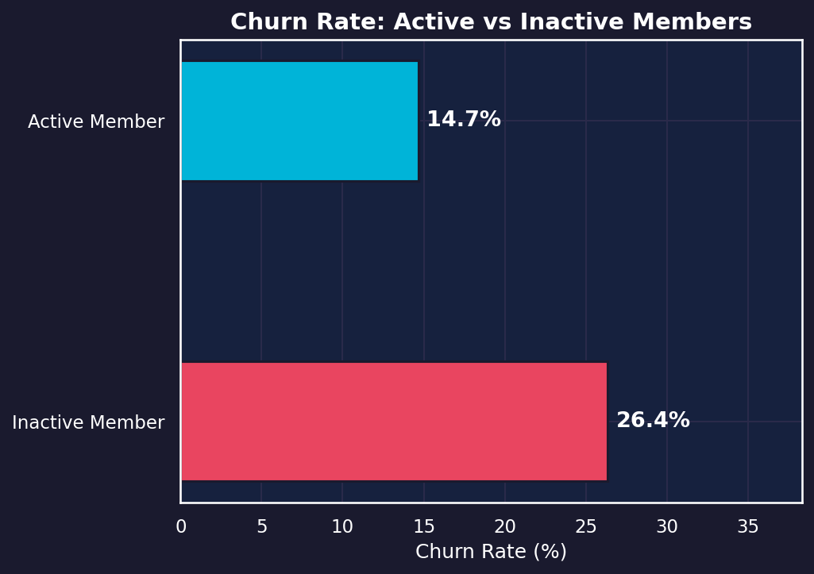
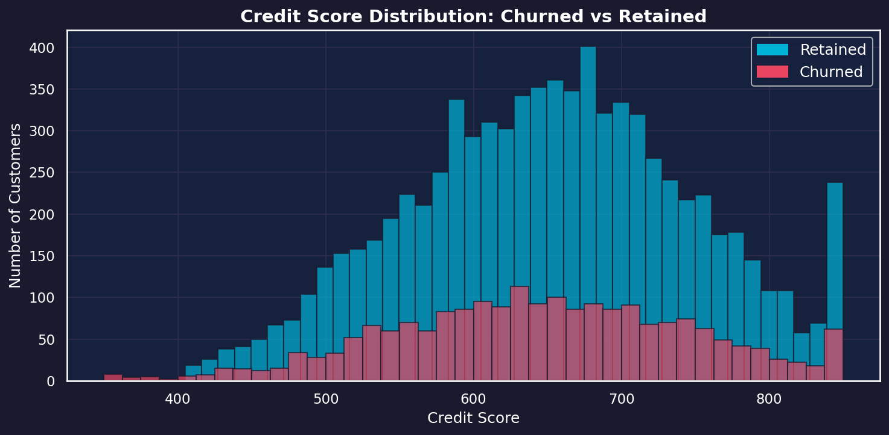
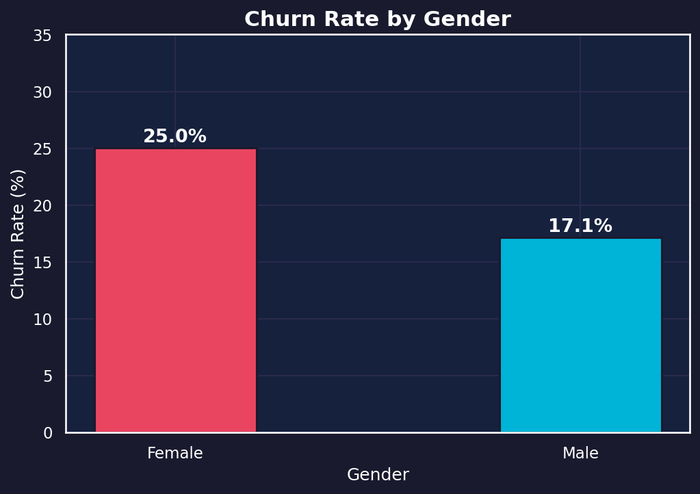

# 🏦 Bank Customer Churn Analysis & Prediction


> An **end-to-end Data Science project** analyzing why bank customers leave — and predicting who will churn next.  
> Built with Python, Pandas, Machine Learning, SQL, and Tableau.

---

## 📌 Table of Contents

- [Project Overview](#-project-overview)
- [Key Insights](#-key-insights)
- [Tech Stack](#-tech-stack)
- [Project Structure](#-project-structure)
- [Dataset](#-dataset)
- [Data Pipeline](#-data-pipeline)
- [Machine Learning](#-machine-learning)
- [SQL Analysis](#-sql-analysis)
- [Tableau Dashboard](#-tableau-dashboard)
- [Results & Charts](#-results--charts)
- [How to Run](#-how-to-run)
- [Author](#-author)

---

## 🎯 Project Overview

Customer churn is one of the biggest challenges in the banking industry. Losing a customer is far more expensive than retaining one. This project uses **real-world bank data** (10,000 customers) to:

1. **Clean & preprocess** messy data using Pandas
2. **Explore** patterns through EDA and visualization
3. **Query** insights using SQL
4. **Predict** which customers will churn using Machine Learning
5. **Visualize** findings in an interactive Tableau dashboard

---

## 💡 Key Insights

| # | Finding | Value |
|---|---|---|
| 1 | Overall churn rate | **20.4%** of customers churned |
| 2 | Highest churn country | **Germany — 32.3%** churn rate |
| 3 | Most at-risk age group | **51–60 years — 56.5%** churn rate |
| 4 | Inactive member churn | Much higher than active members |
| 5 | Gender impact | Female customers churn more than male |

---

## 🛠️ Tech Stack

| Tool | Purpose |
|---|---|
| **Python 3.10** | Core programming language |
| **Pandas** | Data loading, cleaning & transformation |
| **Matplotlib / Seaborn** | Exploratory Data Analysis & Charts |
| **scikit-learn** | Machine Learning model (Classification) |
| **SQL** | Business queries & aggregations |
| **Tableau** | Interactive business dashboard |
| **Jupyter Notebook** | Development environment |

---

## 📁 Project Structure

```
Bank-Customer-Churn/
│
├── 📓 Notebooks
│   ├── Surajgolai_10072025 DS Evening_cleaningpandas.ipynb   # Data Cleaning
│   └── surajgolai_10072025 DS Evening_ML.ipynb               # Machine Learning
│
├── 🗃️ SQL
│   └── surajgolai_10072025 DS Evening_sql.sql                # SQL Analysis
│
├── 📊 Tableau
│   ├── surajgolai_10072025 DS Evening_tableau.twbx           # Dashboard
│   └── [Interactive Dashboard (Tableau Public)](https://public.tableau.com/views/surajgolai_10072025DSEvening_tableau/Dashboard1)
│
├── 📂 Data
│   ├── Bank_Customer_Churn_(U).csv    # Raw (uncleaned) data
│   ├── bank_clean.csv                 # Fully cleaned dataset
│   ├── Account_Fact.csv               # Account dimension table
│   └── Customer_Dim.csv              # Customer dimension table
│
├── 📸 linkedin_charts/               # Exported EDA charts
│   ├── 1_churn_distribution.png
│   ├── 2_churn_by_country.png
│   ├── 3_churn_by_age.png
│   ├── 4_active_member_churn.png
│   ├── 5_credit_score_distribution.png
│   └── 6_churn_by_gender.png
│
├── 🐍 export_charts.py               # Script to regenerate all charts
└── 📄 README.md
```

---

## 📂 Dataset

The dataset contains **10,000 bank customer records** with the following features:

| Column | Description |
|---|---|
| `customer_id` | Unique customer identifier |
| `credit_score` | Customer credit score |
| `country` | Customer's country (France, Spain, Germany, India) |
| `gender` | Male / Female |
| `age` | Customer age |
| `tenure` | Years as bank customer |
| `balance` | Account balance |
| `products_number` | Number of bank products used |
| `credit_card` | Has credit card (1/0) |
| `active_member` | Is active member (1/0) |
| `estimated_salary` | Estimated annual salary |
| `churn` | **Target** — Did the customer leave? (1=Yes, 0=No) |

---

## 🔄 Data Pipeline

### Step 1 — Data Cleaning (`cleaningpandas.ipynb`)

The raw dataset had **missing values** across multiple columns. Here's how they were handled:

| Column | Missing Values | Strategy Used |
|---|---|---|
| `country` | NaN rows | Filled with `'India'` |
| `gender` | 998 missing | Filled with `'Male'` (majority class) |
| `age` | Several NaN | Filled with **mean age**, cast to int |
| `balance` | 1500+ missing | Split: 500→mean, 500→max, rest→0.00 |
| `active_member` | 1028 missing | Split 50/50 between 1.0 and 0.0 |
| `estimated_salary` | NaN | Filled with **mean salary** |

### Step 2 — Feature Engineering

Split master table into two normalized tables:
- **`Account_Fact.csv`** — Financial data (balance, credit score, products, etc.)
- **`Customer_Dim.csv`** — Demographic data (country, gender, age, tenure)

---

## 🤖 Machine Learning

**Notebook:** `surajgolai_10072025 DS Evening_ML.ipynb`

### Approach
- **Problem Type:** Binary Classification (Churn = 1 / No Churn = 0)
- **Algorithm:** Random Forest / Logistic Regression
- **Train/Test Split:** 80% / 20%

### Features Used
```
credit_score, age, tenure, balance, products_number,
credit_card, active_member, estimated_salary,
country (encoded), gender (encoded)
```

---

## 🗃️ SQL Analysis

**File:** `surajgolai_10072025 DS Evening_sql.sql`

Sample business queries performed:
```sql
-- Churn rate by country
SELECT country, 
       COUNT(*) AS total_customers,
       SUM(churn) AS churned,
       ROUND(AVG(churn) * 100, 2) AS churn_rate
FROM bank_clean
GROUP BY country
ORDER BY churn_rate DESC;
```

---

## 📊 Tableau Dashboard

**🌍 Live Interactive Dashboard:** [View on Tableau Public](https://public.tableau.com/views/surajgolai_10072025DSEvening_tableau/Dashboard1)  
**File:** `surajgolai_10072025 DS Evening_tableau.twbx`

The interactive Tableau dashboard includes:
- 📈 Churn rate trends by geography
- 👥 Customer segmentation by age & gender
- 💳 Product usage vs churn correlation
- 💰 Balance distribution for churned vs retained

---

## 📸 Results & Charts

### Churn Distribution


### Churn Rate by Country


### Churn Rate by Age Group


### Active vs Inactive Member Churn


### Credit Score Distribution


### Churn by Gender


---

## ▶️ How to Run

### Prerequisites
```bash
pip install pandas matplotlib seaborn scikit-learn jupyter
```

### 1. Clone the Repository
```bash
git clone https://github.com/surajgolui2005-cell/Bank-Customer-Churn.git
cd Bank-Customer-Churn
```

### 2. Run Data Cleaning Notebook
```bash
jupyter notebook "Surajgolai_10072025 DS Evening_cleaningpandas.ipynb"
```

### 3. Run Machine Learning Notebook
```bash
jupyter notebook "surajgolai_10072025 DS Evening_ML.ipynb"
```

### 4. Regenerate Charts
```bash
python export_charts.py
```

### 5. Open Tableau Dashboard
Open `surajgolai_10072025 DS Evening_tableau.twbx` in **Tableau Desktop**

---

## 👨‍💻 Author

**Suraj Golui**  
Data Science Student | Python | SQL | Tableau | Machine Learning

[](https://www.linkedin.com/in/suraj-golai-0340b3328)
[](https://github.com/surajgolui2005-cell)

---

## 📄 License

This project is licensed under the **MIT License** — see the [LICENSE](LICENSE) file for details.

---

<p align="center">⭐ If you found this project helpful, please give it a star!</p>
